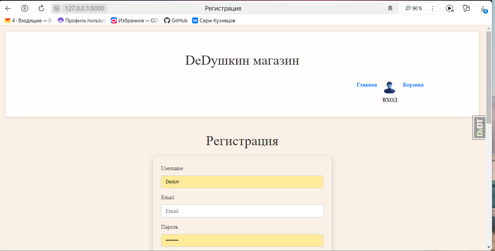
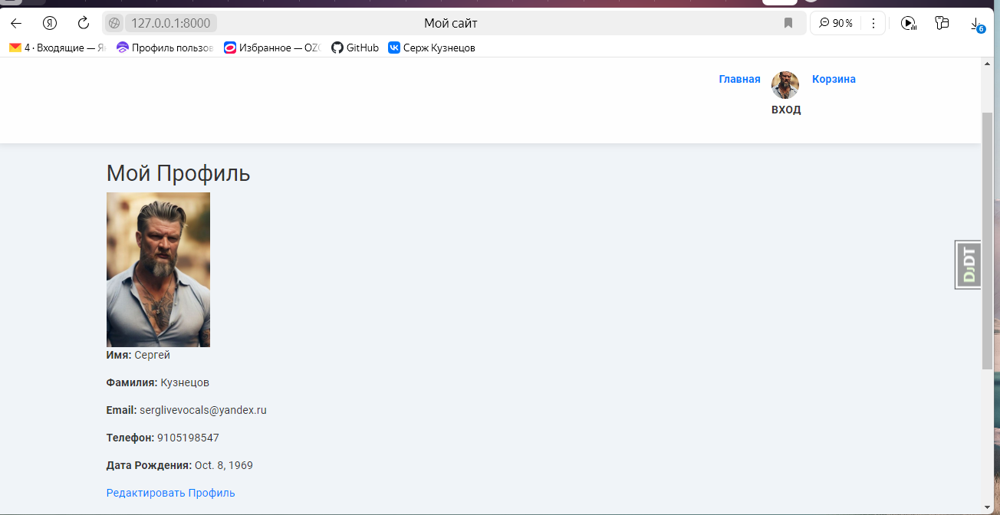
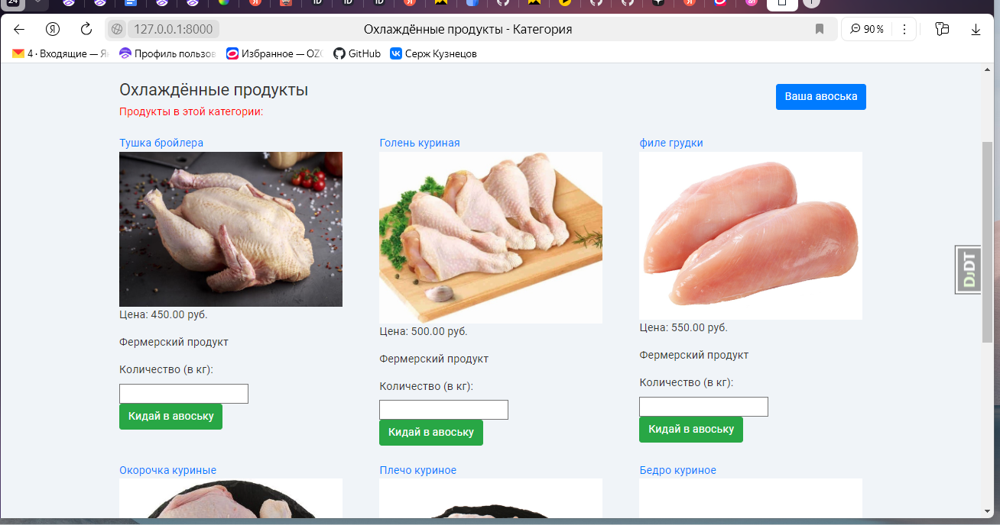
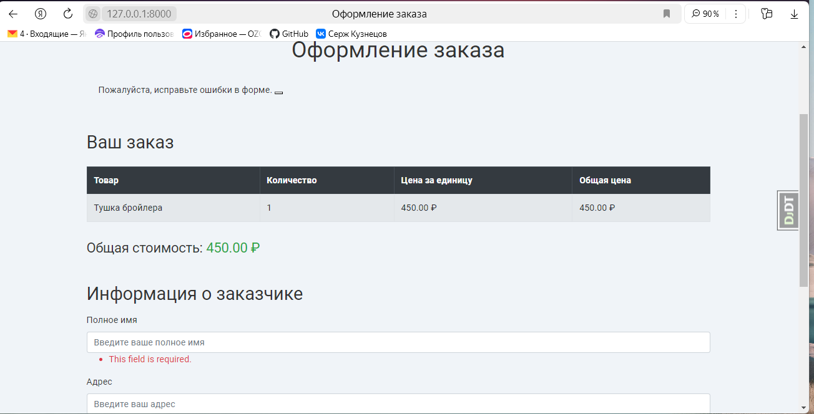

# Приложение на Django для простого интернет-магазина
Данное приложение разработано на базе Django, которое позволит пользователю осуществлять продажи, регистрировать покупателей, отслеживать товарные остатки, формировать заказы.
Использованы механизмы для регистрации и авторизации покупателей, а так же возможность редактирования профиля. 

## Содержание

- [Технологии](#технологии)
- [Использование](#использование)
- [Структура проекта](#структура-проекта)
- [Тестирование](#тестирование)
- [Для чего создан проект?](#для-чего-создан-этот-проект)
- [Разработчик](#разработчик)
- [Источники](#источники)

## Технологии
- Django
- Django REST Framework
- SQLite
- Bootstrap(интерфейс)
- 

## Использование
Для установки и использовании данного проекта необходимо:

Установите Django с помощью команды:
```
pip install django djangorestframework
```
Если проект находится в репозитории GitHub его необходимо клонировать:
```
git clone <URL вашего репозитория>
cd <папка проекта>
```
Выполнить миграции для создания таблиц в базе данных. В случае использования SQLite дополнительных действий не требуется.
```
python manage.py makemigrations #создание миграций
python manage.py migrate
```
Создаём суперпользователя для доступа к административной панели Django:
```
python manage.py createsuperuser
```
Запускаем сервер разработки:
```
python manage.py runserver
```
По умолчанию сервер доступен по адресу: http://127.0.0.1:8000/
Доступ к административной панели: http://127.0.0.1:8000/admin/
И войдите используя учётные данные суперпользователя, которые создали ранее.


## Структура проекта

### Домашняя страница

На домашней странице есть ссылка "Вход" для зарегистрированных пользователей.
Кнопка "Регистрация"
Кнопка "К покупкам"
### Регистрация

Пользователь получает возможность зарегистрировать свои данные
### Страница авторизации

Если пользователь зарегистрирован он после нажатия кнопки вход попадает в свой профиль.
### Страница профиля

Пользователь имеет возможность редактирования своего профиля. 
На странице есть кнопки 
### Редактирование профиля


### Категории продуктов

Переходим непосредственно к покупкам. Выбираем категорию товара

### Продукты категории

В каждой категории есть список товара с фото, наименованием, описанием и ценой.
Отправляем товар в корзину

### Карточка продукта

Каждый продукт имеет карточку с наименованием, ценой, описанием
Отправляем товар в корзину

### Корзина

В корзине находиться выбранный товар, возможность изменить количество(кнопка обновить),
Возможность удалить товар из корзины.
Кнопка "Оформить заказ"

### Оформление заказа

Пользователь заполняет форму и подтверждает заказ

### Подтверждение заказа

После подтверждения пользователь получает информацию о номере, дате, времени, сумме, статусе и составе заказа

## Тестирование
В коде проекта прописаны тесты для моделей Category, Product,
Cart и UserProfile. Тесты запускаются командой:
```sh
python manage.py test 
```
## Для чего создан этот проект?
Данный проект создан для малого бизнеса с небольшим функционалом. Осуществление продаж, регистрация покупателей, формирование заказов и отслеживание товарных остатков.

## Разработчик
Сергей Кузнецов

## Источники
https://www.django-rest-framework.org/

Э. Матиз "Изучаем Python. Программирование игр, визуализация данных, веб-приложения" 3-изд. СПб.: Питер 2024

Дронов В. А. "Django 4. Практика создания веб-сайтов на Python" -СПб.:БХВ-Петербург, 2024
